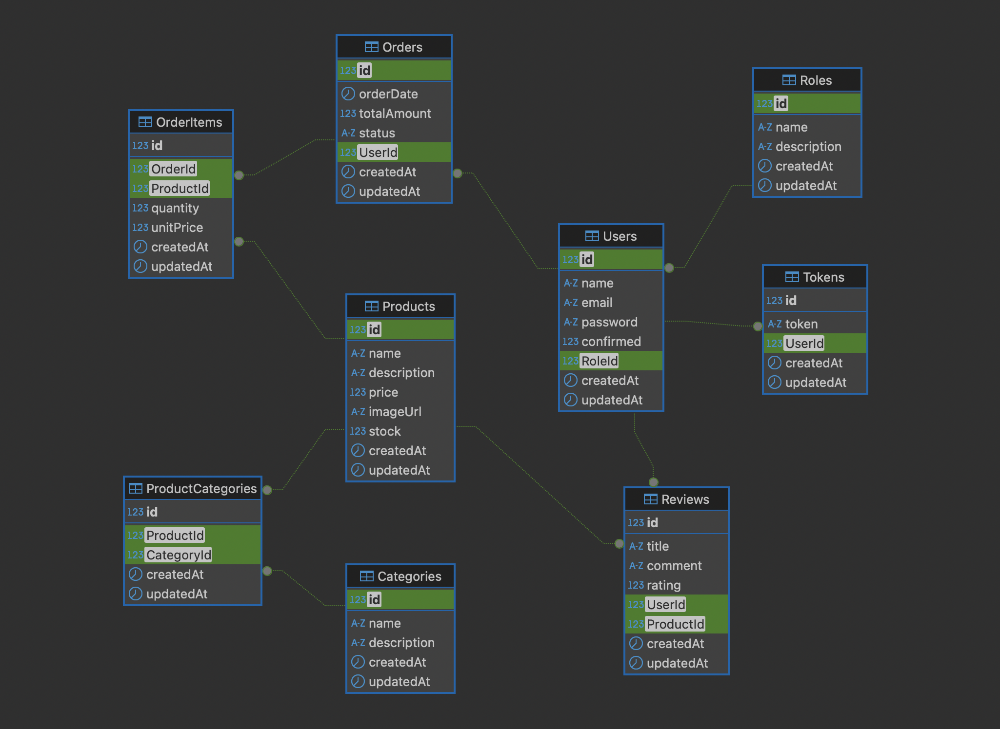

# 🛒 E-Commerce Backend API with Node.js & Sequelize

A robust RESTful API for an e-commerce platform built with Node.js, Express, and Sequelize (MySQL). Features user authentication, product management, order processing, and admin controls.

---

## 🚀 Tech Stack

- **Node.js** 
- **Express.js** 
- **MySQL** 
- **Postman** 
- **DBeaver** 
- **JavaScript** 
- **Sequelize** 

---

## ✨ Key Features

- **JWT Authentication** with Bcrypt password hashing
- **Role-based access control** (Admin/User)
- **CRUD Operations** for Products, Categories, Orders, Users
- **Relationships**:
  - One-to-Many: `User → Orders`
  - Many-to-Many: `Products ↔ Categories`
- **Image Uploads** using Multer middleware
- **Product Reviews & Ratings** system
- **Database Seeders** for sample data
- **Advanced Filtering**:
  - Product search by name/price
  - Category search by name
  - Price sorting (high-low)
- Git branch strategy (`main` + `develop`)

---

## 📊 Database Relationships

Below is the current MySQL schema as visualized in DBeaver:

### Relationship Details

### One-to-Many Relationships

- **Users → Orders (1-to-Many)** - One user can place multiple orders
- **Users → Reviews (1-to-Many)** - One user can write multiple reviews
- **Users → Tokens (1-to-Many)** - One user can have multiple authentication tokens
- **Roles → Users (1-to-Many)** - One role can be assigned to multiple users
- **Orders → OrderItems (1-to-Many)** - One order can contain multiple items
- **Products → OrderItems (1-to-Many)** - One product can appear in multiple order items
- **Products → Reviews (1-to-Many)** - One product can receive multiple reviews

### Many-to-Many Relationships

- **Products ↔ Categories (Many-to-Many)** - Products can belong to multiple categories, and categories can contain multiple products
  - **ProductCategories (Junction Table)** - Resolves the many-to-many relationship between Products and Categories

### Models Structure

| Model               | Fields                                                    |
| ------------------- | --------------------------------------------------------- |
| **User**            | `id`, `name`, `email`, `password`, `confirmed`, `RoleId`  |
| **Role**            | `id`, `name`, `description`                               |
| **Order**           | `id`, `orderDate`, `totalAmount`, `status`, `UserId`      |
| **OrderItem**       | `id`, `OrderId`, `ProductId`, `quantity`, `unitPrice`     |
| **Product**         | `id`, `name`, `description`, `price`, `imageUrl`, `stock` |
| **Categorie**       | `id`, `name`, `description`                               |
| **ProductCategory** | `id`, `ProductId`, `CategoryId`                           |
| **Review**          | `id`, `title`, `comment`, `rating`, `UserId`, `ProductId` |
| **Token**           | `id`, `token`, `UserId`                                   |

---

## 👥 Authors

Iker Prieto - GitHub Profile

Iñaki ... - GitHub Profile

Egoitz Aulestia - GitHub Profile
